# Locating and Detecting Language Model Grounding in Whisper with Fakepedia

## Introduction
For my project I decided to follow the paper "A Glitch in the Matrix?  Locating and Detecting Language Model Grounding with Fakepedia" and check how similar Whisper is to LLMs when it comes to activation patterns when hallucinating.

## The dataset
The dataset consists of factual wikipedia like entries where each of the statements is modified by replacing a Name to make the statement false. 

The original entries are selected such that a model pretrained on the internet ought to have learned them as factual. 

The model is expected to answer a question about one piece of information from the modified entry, a specific Subject Object relationship (i.e. question:Microsoft Office XP, a product developed by ... answer:(Microsoft,Nintendo, ...)), with the information from the entry. 

The answer is determined by the first token returned and is said to be grounded if it is faithful to the entry (i.e. the first token of the Object stated in the entry) if it is the first token of the true fact it is deemed unfaithful, otherwise it is ignored.

Because Whisper often rated words like “the”, “an” and “and” highly we had to modify this to look at whether the faithful token is contained in the top 20 and the unfaithful is not and symmetrically. We again ignore the cases when both are in the top 20 or neither is.

## The method
To analýze model behavior data for predicting whether the answer was based on the entry or not the authors use causal tracing. This is a method that allows to trace the influence of specific layers at input positions on the output of a model. The idea is to replace the tokens in the question containing the Subject with the mask tokens, which should hopefully have a relatively meaningfree embedding. Then when doing a forward pass they run both the corrupted input and the original input in parallel. They choose a module kind at a layer and restore the output value in the corrupted run with the original output value. They then analyze how much of the answer (the most probable answer regardless of whether grounded or unfaithful) output probability change is removed in the partially restored output.

## Setup
We borrowed a large part of the codebase from the original paper. The things we had to add was converting the text only fakepedia entries into audio files, and then running the Whisper encoder on these.

We decided to change the format form “Contex:...Answer:..” to simply have the answer as the next sentence because Whisper seemed less likely to have come across such statements. In retrospect it seems to have been a mistake as the decoder language model often gives a very large probability to a stopword.

To turn the text into audio files we decided to use the text2wave utility from the festival package. It sounds very unnatural but is very legible. To check feasibility we reran the Whisper model on a subset of the librispeech dataset where we replaced the actual vocalization with the text2wave sound, as a result the WER rose from 5% to 10%. we consider this a plus because we worried that for natural noise-less inputs the audio signal conditioning would have too strong an effect and we could not ignore it during causal tracing. One issue was that we had to provide some speech even for the answer to the question.

For this we decided to use the grounded name but add an independently sampled normal noise with 0 mean and 0.2 std to each time step of its waveform (applied on waveforms in the torchaudio internal format ranging from -1 to 1). Once we had the conditioning signal the Whisper decoder could be treated similar to a decoder-only LLM.

We also added multiprocessing support so we didn't need to wait so long when processing fakepedia.

## Analysis
In this section we will replicate the graphs from the original paper for Whisper and present a detailed description of my simple hallucination detection model for Whisper.

When we plot the amount of difference from the corrupted run when restoring different layer kinds at different positions (in the at the first position of the subject mention in the position, the first position, and the middle or last positions in these) we get the following graphs:

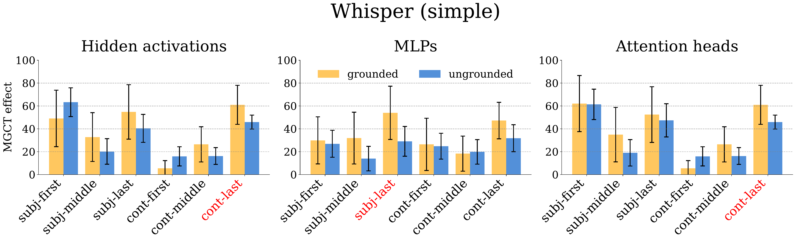
The red labels in this figure show the position groups where the difference is statistically significant. Please note that we chose to increase the threshold to 0.05 for our plot and the original paper plots use a threshold of 0.01. For the 0.01 threshold we get no significant differences because of our smaller amount of datapoints.

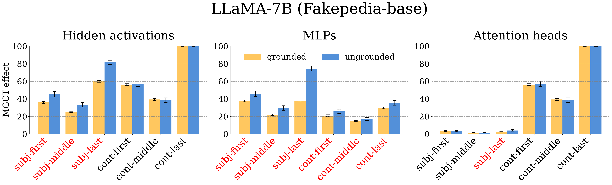
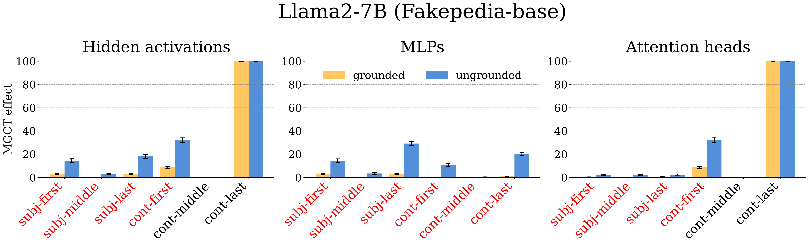
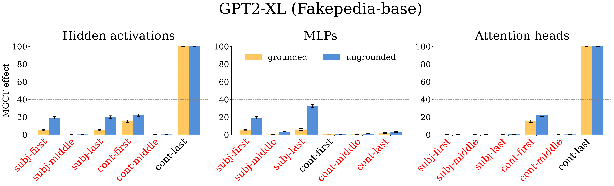

When we compare our results they are at the first glance much noisier, this is obvious as we used a total of 46 samples while the paper used 4935 samples for LLaMa and even more for LLaMa2. We can also notice that the last token of the continuing sentence is a lot more important in the Whisper model than in any of the ones in the paper. This is likely because the model is smaller and conditioned on the audio signal and thus the previous token is looked at more even if not that semantically relevant. It could also be caused by coincidence, our subsample could have its distribution shifted when compared to the whole dataset.

### Recreating the clasifier from the paper experiments
We decided to use the experimental data collected for the LLaMa2 model by the paper authors because LLaMa2 gave the second most grounded responses and it is a never model than LLaMa. 

The paper mentions that when predicting whether the model output was grounded the most important feature for XGBoost is the MGCT effect at the MLP subj-last position at 23.4% relative importance. In our experiments with the code and models used in the paper we found a very similar relative importance value for that feature. But the MGCT effects at the MLP cont-last is chosen as the most important feature with up to 60% relative importance. This is strange as the difference between these effects when looking at grounded and ungrounded samples in the paper's figure is statistically significant but not that large. 

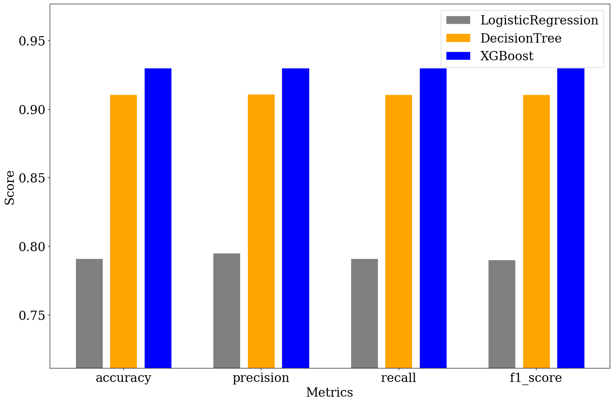
We got around the same accuracy for the XGBoost model for their experiment as they got in the paper.

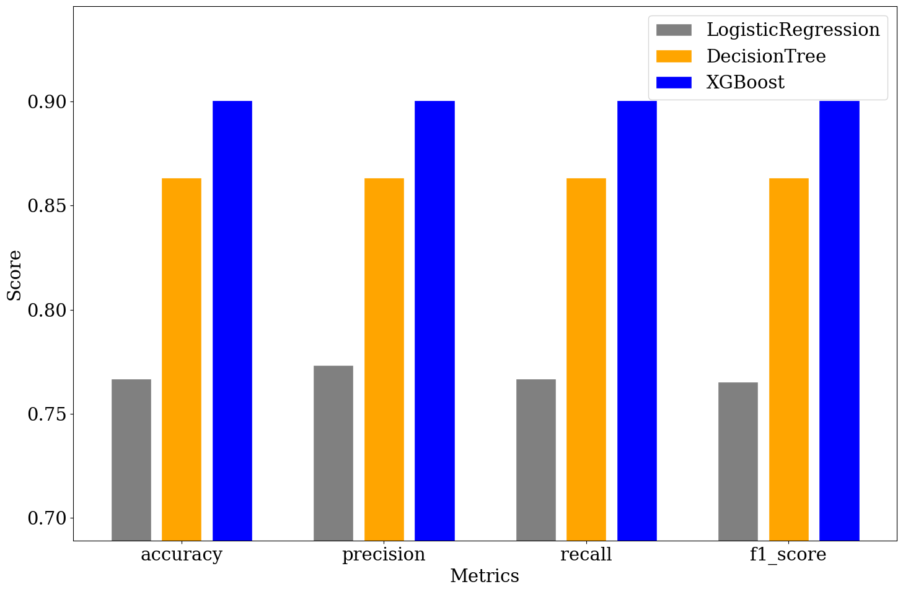
It is true that when removing the features at the cont-last position only a very small decrease in accuracy happened across models.

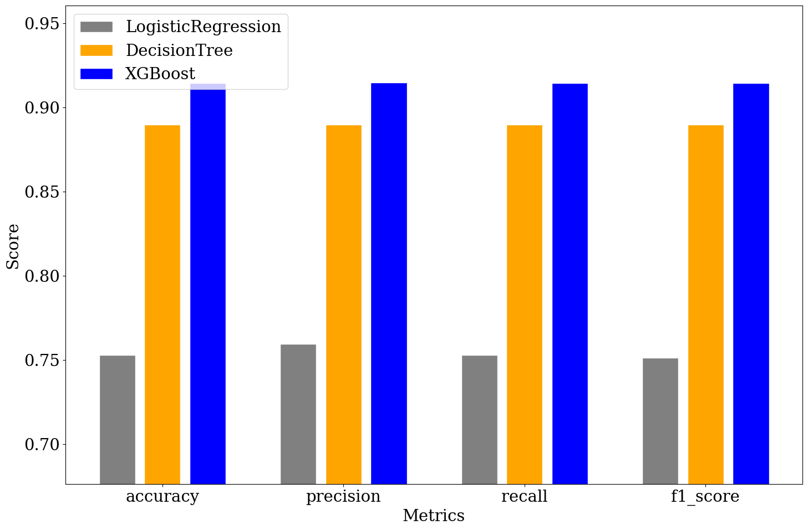
When we remove the positions with least relevant features we get a similar drop in accuracy as when removing only the features at the cont-last position.

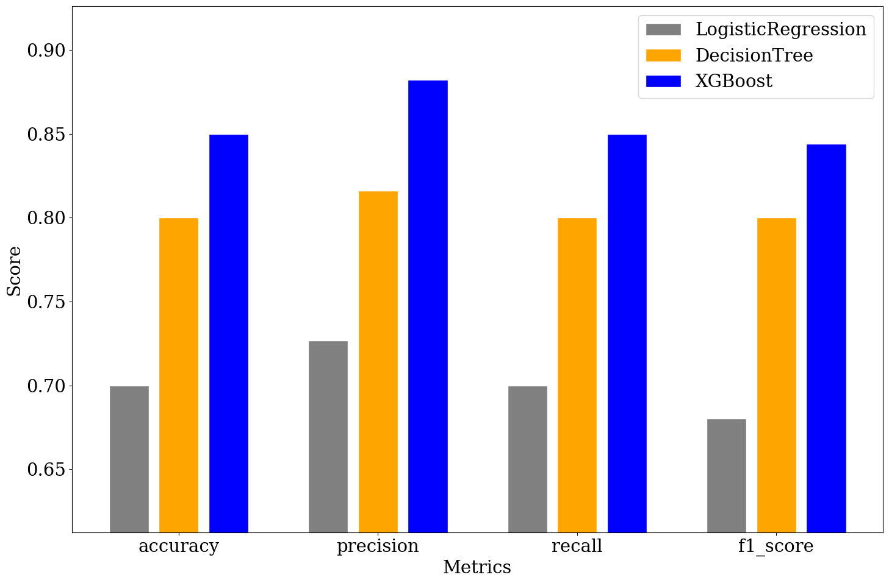
When we look at the results of the classifiers trained on only 40 samples we see that the accuracy is somewhat lower but the effect isn't so significant.

### Fitting a classifier on our data
Our results are trained only on a fraction of the data so it is somewhat expected that we get worse results than the paper.

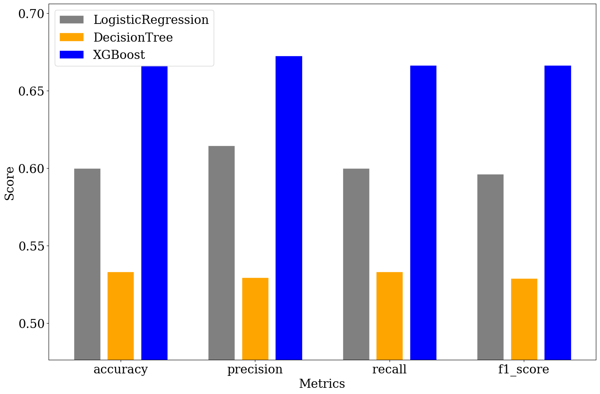
When using all the features it seems that the decision tree method ovefitted significantly, the other two methods also seem to have lower metric values that the paper's results.

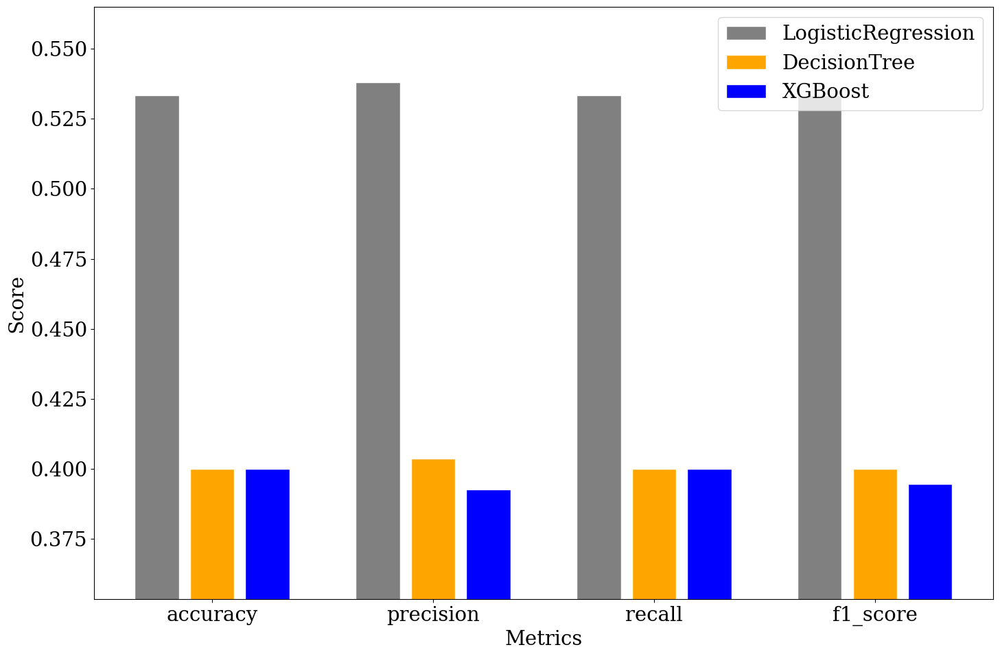
When we remove the cont-last all methods except for linear regression get very bad results and linear regression still has a very low accuracy.

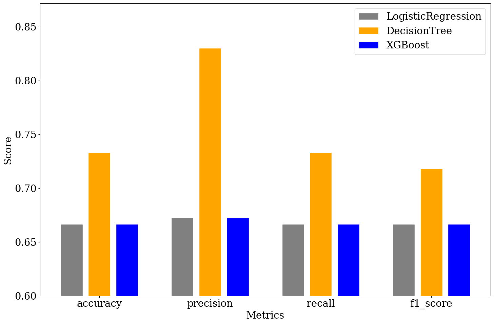
Only when we remove the positions with the least relevant features as indicated by the feature importances extracted from repeating the paper experiments with the XBoost model do we get results that are somewhat similar to the paper's results. The decision tree model no longer overfits so much and we get most metrics above 0.7.

## Conclusions
It seems from the experiments that for the most important token posiitons the base Whisper decoder (72M parameters) exhibits behaviour similar to the small LLMs tested in the paper (GPT-xl-1.5B, LLaMa-7B and LLaMa2-7B).

This is quite interesting given how strongly conditioned the model is. The speech signal, even when unnatural and, at the final position, noisy, should hold all the information necessary for predicting the final token. Even further surprising was the amount of impact masking tokens in the decoder had, given that they were given no artificially induced noise.

This shows that the language model learned in the decoder is indeed somewhat strict compared to the conditioning signal when given uncertain audio. This likely explains why the model hallucinates so much when given out of distribution or noisy inputs.

As we have shown we can use this to train a model to detect hallucinations. From the examples we can see that for a constrained task only a minimal amount of data is required.